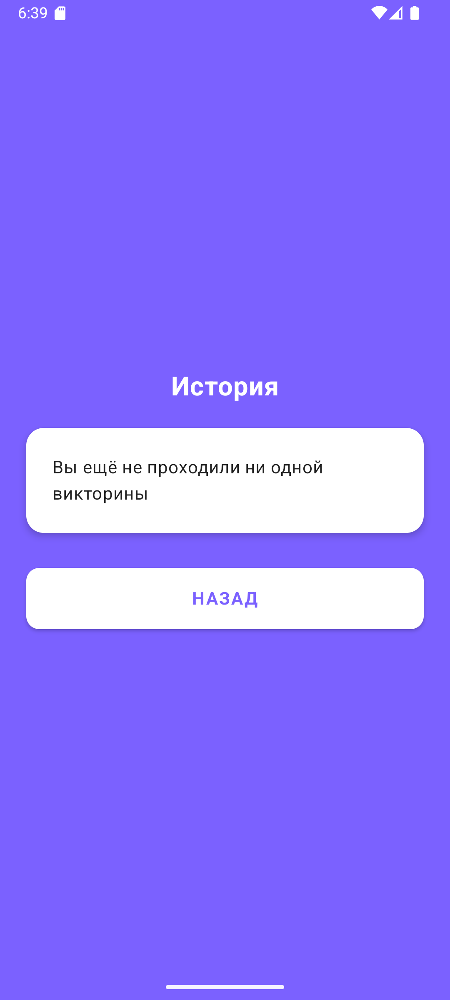

# DailyQuiz

DailyQuiz — это Android-приложение, позволяющее пользователям проходить короткие викторины из 5 вопросов и видеть результат. Реализовано на Jetpack Compose.

---

## Функциональность

-  Приветственный экран с выбором действия: начать викторину или посмотреть историю.

-  Прохождение викторины:
    - Отображение заголовка и текста вопросов.
    - Выбор одного из 4 вариантов ответа.
    - Кнопка «Далее»,которую нельзя нажать пока не выбран один из вариантов ответа.

-  Экран результатов:
    - Подсчёт правильных ответов.
    - Персонализированное сообщение по результатам.
    - Кнопки: «Начать заново», «Разобрать викторину».

-  Экран разбора:
    - Просмотр всех вопросов,с помощью прокрутки экрана(зажатием левой кнопки мыши).
    - Подсветка правильного/неправильного ответа.
    - Иконки: галочка и крестик для визуального разбора.

-  Экран истории (без данных).

---

## Скриншоты работы приложения

### Экран приветствия

### Экран викторины

### Экран результатов

### Экран разбора викторины

### Экран истории

